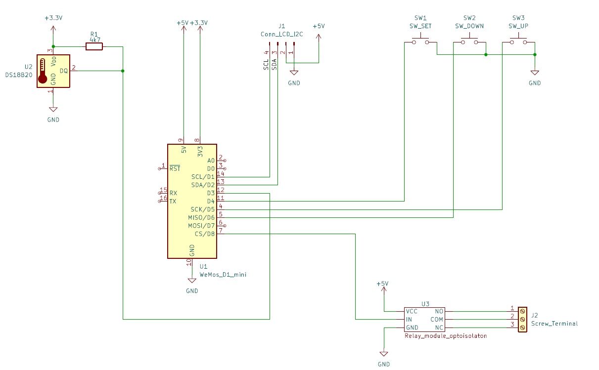

# Temperature Controller with ESP8266, WiFi, and 230V Relay

## Introduction  
This project is a water temperature controller based on the ESP8266 microcontroller. It uses a waterproof DS18B20 temperature sensor to measure the temperature and controls a relay to turn a heating element on or off. The device features an LCD display, WiFi connectivity, and a simple button-based menu for setting parameters.


## Features
- Temperature measurement using [DS18B20](https://www.analog.com/media/en/technical-documentation/data-sheets/DS18B20.pdf)
- Relay control based on target temperature and hysteresis
- **LCD display** showing current temperature, target temperature, and relay state
- Menu system with three buttons for setting temperature and hysteresis
- **WiFi connectivity** with a web interface for monitoring and control

## Components  
- **ESP8266-12F Microcontroller** (Wemos D1 mini V2)  
- **Waterproof DS18B20 Temperature Sensor**  
- **Opto-isolated 5V Relay Module**  
- **16x2 LCD Display**  
- **I2C Expander for LCD**  
- **Three Momentary Push Buttons (Tact Switches)**  
- **4.7kΩ Resistor**  
- **4cm × 6cm Perfboard**  
- **Goldpin Connectors**  

## Schematic


The circuit consists of a **perfboard** with connectors for:
- I2C LCD (4 pins)
- relay module (3 pins)

and a **socket** for the Wemos D1 mini.


## Web Interface
The built-in web server provides:
- Temperature display
- Options to set the target temperature and hysteresis
- Relay status


### WiFi Configuration
DHCP server must be active on the network, or an IP address must be assigned to the device's MAC address.

The WiFi credentials are predefined in the code:  
```cpp
const char* ssid = "Your_network";
const char* password = "password";
```
## User manual
### Wifi connecting
1. After connecting the power, the regulator tries to connect to the WiFi network programmed in the code. The connection attempt lasts about 10 seconds.


2. Then, the device switches to temperature regulation (main screen).

### Buttons
The thermostat is equipped with buttons that allow local control of its functions.
1. **MENU** button: Allows switching between the menu screens displayed on the LCD.
2. **DOWN** and **UP** buttons: Used to decrease or increase the temperature or hysteresis values on the LCD display in the appropriate menu screen.

### Screens
0. **Main screen**: display current state


1. **Temperature setting**: You can set the target temperature to which the device should heat the water.


2. **Hysteresis setting**: You can set the hysteresis value, i.e., the tolerance temperature difference at which the device turns the heater on or off.


3. **Wi-Fi connection status**: The IP address is displayed, from which you can control the device via a browser. If unavailable: (IP unset).


The device returns to the main screen after 3 seconds of inactivity.